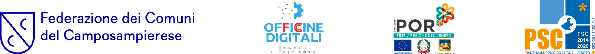

# Introduzione

Popolazione Residente è una webapp caratterizzata dall’esplorazione - tramite Data Visualization - di alcuni aspetti socio demografici riguardanti i comuni appartenenti alla Federazione del Camposampierese. I dati rappresentati dai modelli visivi riguardano l’andamento demografico nei dieci comuni della Federazione.

# 1. Tipologia di webapp ed utilizzo

Le webapp in questione è raggiungibile al seguente link:

[https://officinedigitali.fcc.veneto.it/PopolazioneResidente/](https://officinedigitali.fcc.veneto.it/BilancioDemografico/)

Si presenta come classica pagina web, con possibilità di interazione da parte dell’utente al fine di esplorare il dataset analizzato orientandosi fra diverse viste di dettaglio.

# 2. Aspetti tecnici

La webapp di visualizzazione dati è stata realizzata tramite le classiche tecnologie web moderne, HTML come linguaggio di strutturazione della pagina e markup web, CSS come principale metodo di formattazione della pagina e stile, e Javascript come linguaggio di programmazione web lato client (frontend) al fine di implementare l’interattività, visualizzazione ed elaborazione dei dati all’interno della pagina. In particolar modo viene utilizzata in maniera massiccia una specifica libreria JavaScript adatta alla visualizzazione dei dati ([d3.js)](https://d3js.org/) .

# 3. Utilizzo in locale

Per poter interagire e modificare localmente la piattaforma di visualizzazione dati **“Popolazione Residente”** è necessario effettuare il download dell’intero contenuto della repository presente su github al seguente link:

[https://github.com/FCC-OfficineDigitali/app-demografiche](https://github.com/FCC-OfficineDigitali/app-demografiche)

Tramite l’editor Visual Studio Code è sufficiente aggiungere il plugin [Live Server](https://marketplace.visualstudio.com/items?itemName=ritwickdey.LiveServer) e procedere alla messa online in locale tramite l’apposito bottone presente sulla barra di fondo dell’editor: “Go Live”.

Differentemente da quanto descritto sopra, la messa online di un server locale può essere effettuata anche tramite npm, seguendo le istruzioni presenti al seguente link:

[https://www.npmjs.com/package/live-server](https://www.npmjs.com/package/live-server)

Al fine di utilizzare quest’ultimo metodo è necessario che nel dispositivo sia installato il gestore di pacchetti npm.

# 4. Crediti

Lavoro sviluppato da Mattias Basso, Jacopo Trabona e Luca Zanardelli di Quantitas S.R.L. in collaborazione con Federazione dei Comuni del Camposampierese - Officine Digitali (ente attuatore del progetto).

